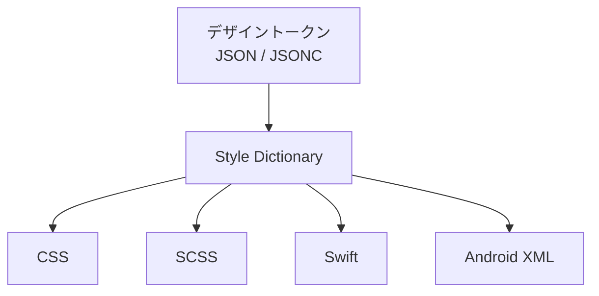
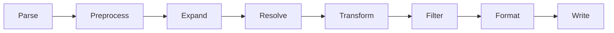

# Style Dictionary

ssotyle は Style Dictionary の Rust 実装を目指すプロジェクトである。
この文書では、オリジナルの Style Dictionary (JavaScript) の設計と仕組みを解説する。

## Style Dictionary とは

Style Dictionary は「デザイントークン」を一元管理し、CSS、Android XML、iOS Swift など複数のプラットフォーム向けコードに自動変換するビルドシステムである。



## デザイントークンの形式

トークンは JSON (または JSON5) のネストされたオブジェクトで記述する。
DTCG (Design Tokens Community Group) 仕様に準拠し、プロパティ名に `$` プレフィックスを使う。

```json
{
  "colors": {
    "$type": "color",
    "black": {
      "$value": "#000000"
    },
    "white": {
      "$value": "#ffffff"
    },
    "orange": {
      "500": {
        "$value": "#ed8936"
      }
    }
  }
}
```

ポイント:

- `$value` がトークンの値
- `$type` はグループレベルで指定でき、子トークンに継承される
- ネストの深さは自由

## 参照 (Reference)

トークンは他のトークンを `{path.to.token}` の構文で参照できる。

```json
{
  "color": {
    "brand": {
      "$value": "{colors.orange.500}"
    },
    "button": {
      "primary": {
        "$value": "{color.brand}"
      }
    }
  }
}
```

参照はチェーンできる (A → B → C)。
Style Dictionary はこれを再帰的に解決し、循環参照を検出する。

## コンフィグファイル

`config.json` でソースファイルのパス、プラットフォームごとの出力設定を定義する。

```json
{
  "source": ["tokens/**/*.json"],
  "platforms": {
    "css": {
      "transformGroup": "css",
      "buildPath": "build/css/",
      "files": [
        {
          "destination": "_variables.css",
          "format": "css/variables"
        }
      ]
    },
    "android": {
      "transformGroup": "android",
      "buildPath": "build/android/",
      "files": [
        {
          "destination": "colors.xml",
          "format": "android/colors"
        }
      ]
    }
  }
}
```

## パイプライン

Style Dictionary のビルドは以下の順に処理される。



### Parse

`source` と `include` で指定されたグロブパターンに一致する JSON ファイルを読み込み、一つのオブジェクトに結合 (deep merge) する。

### Preprocess

ユーザー定義の前処理関数を適用する。DTCG 構文の検出もここで行う。

### Expand

複合トークン (typography など複数の値を持つもの) をフラットなトークンに展開する。

### Resolve

`{colors.brand}` のようなトークン参照を実際の値に解決する。
解決は while ループで繰り返され、チェーン参照 (A → B → C) にも対応する。
参照先が未解決の場合は次のイテレーションに先送りされ、解決数が増えなくなったら循環参照エラーとする。

### Transform

プラットフォームごとにトークンの属性を変換する。変換には 3 種類がある。

| 種類 | 対象 | 例 |
|------|------|------|
| name | トークン名 | `colors-brand` → `colorsBrand` |
| value | トークンの値 | `#ff0000` → `rgba(255, 0, 0, 1)` |
| attribute | メタデータ | CTI (Category/Type/Item) 属性の付与 |

組み込みの変換グループ (transformGroup) として `css`、`android`、`ios`、`ios-swift` などが用意されている。

### Filter

出力ファイルごとに、対象のトークンを絞り込む。
例えば `"filter": {"$type": "color"}` と指定すれば色のトークンだけ出力される。

### Format

フィルタ済みトークンを、出力先の形式に変換する。

`css/variables` フォーマットの出力例:

```css
:root {
  --colors-black: #000000;
  --colors-white: #ffffff;
  --colors-orange-500: #ed8936;
}
```

### Write

フォーマットされた文字列を `buildPath` + `destination` のパスにファイルとして書き出す。

## 拡張ポイント (Hooks)

Style Dictionary は以下のフックでカスタマイズできる。
ssotyle では、まず組み込みの実装に集中し、拡張は後回しにする。

- parsers: カスタムファイルパーサー
- preprocessors: トークンの前処理
- transforms: 値の変換ロジック
- transformGroups: 変換のセット
- formats: 出力形式
- filters: トークンのフィルタリング
- fileHeaders: ファイルヘッダーコメント
- actions: ビルド後のカスタムアクション (コピー等)

## 主要なデータ構造

### DesignToken

```
DesignToken {
    $value: any         // トークンの値
    $type: string       // トークンの型 ("color", "dimension" 等)
    $description: string // 説明
    name: string        // 変換後の名前
    path: [string]      // オブジェクトパス ["colors", "orange", "500"]
    original: Token     // 変換前のコピー
    filePath: string    // 定義元ファイル
    attributes: {}      // メタデータ
}
```

### Config

```
Config {
    source: [string]                   // トークンファイルのグロブパターン
    include: [string]                  // 追加の読み込みパターン
    platforms: { name → PlatformConfig } // プラットフォームごとの設定
    usesDtcg: bool                     // DTCG 構文を使うか
}
```

### PlatformConfig

```
PlatformConfig {
    transformGroup: string  // 変換グループ名
    transforms: [string]    // 個別の変換名リスト
    buildPath: string       // 出力先ディレクトリ
    prefix: string          // CSS 変数等のプレフィックス
    files: [File]           // 出力ファイルの設定
}
```

### File

```
File {
    destination: string  // 出力ファイル名
    format: string       // フォーマット名
    filter: Filter       // トークンの絞り込み条件
    options: {}          // フォーマット固有のオプション
}
```
