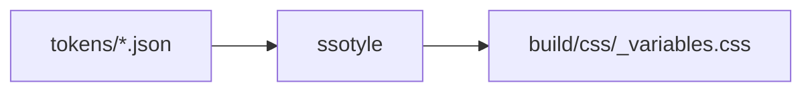
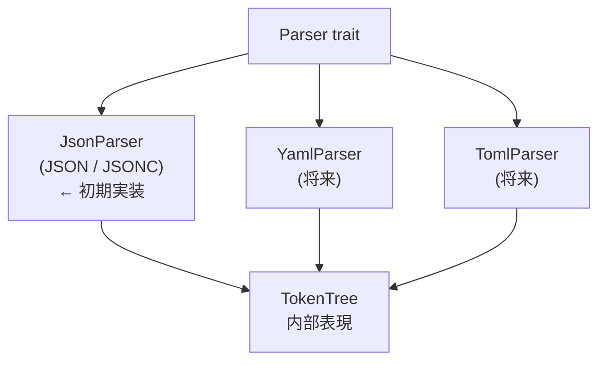
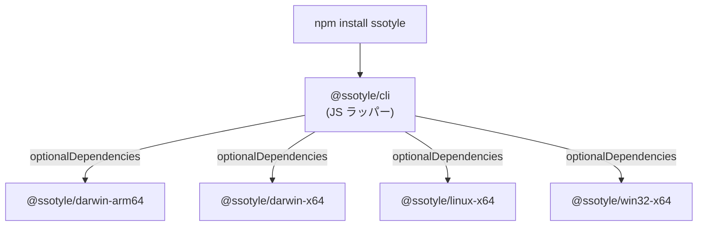

# ssotyle 実装計画

Style Dictionary の Rust 実装における、段階的な実装計画をまとめる。

## 初期ゴール

JSON (JSONC) → CSS 変換を動かすこと。



## 設計方針

### パーサーの抽象化

入力フォーマットはトレイトで抽象化し、将来の拡張に備える。



パーサーの役割は「ファイルの中身を読み取って `TokenTree` に変換する」ことだけ。
ファイル拡張子でパーサーを自動選択する。

```rust
trait Parser {
    /// このパーサーが対応する拡張子のリスト
    fn extensions(&self) -> &[&str];

    /// バイト列を TokenTree にパースする
    fn parse(&self, content: &[u8]) -> Result<TokenTree, SsotyleError>;
}
```

`serde` を使えば、どのフォーマットでも同じ `TokenTree` (内部的には `serde_json::Value` 相当) に統一できる。
各パーサーは薄いアダプター層になる。

| フォーマット | 拡張子 | パース用クレート |
|-------------|--------|----------------|
| JSON | `.json` | `serde_json` |
| JSONC | `.jsonc` | `json5` (コメント付き JSON をサポート) |
| YAML | `.yaml`, `.yml` | `serde_yaml` |
| TOML | `.toml` | `toml` |

### フォーマッターの抽象化

出力側も同様にトレイトで抽象化する。初期実装は CSS Variables のみ。

```rust
trait Formatter {
    fn name(&self) -> &str;
    fn format(&self, tokens: &[DesignToken], options: &FormatOptions) -> String;
}
```

## 目標とするディレクトリ構成

```
ssotyle/
├── Cargo.toml
├── docs/                    # ドキュメント群
├── src/
│   ├── main.rs              # CLI エントリポイント
│   ├── lib.rs               # ライブラリルート
│   ├── config.rs            # Config の定義とパース
│   ├── token.rs             # DesignToken / TokenTree の定義
│   ├── error.rs             # エラー型の定義
│   ├── parser/
│   │   ├── mod.rs           # Parser トレイトとレジストリ
│   │   └── json.rs          # JSON / JSONC パーサー
│   ├── reference.rs         # {xxx.yyy} 参照の解決
│   ├── transform/
│   │   ├── mod.rs           # Transform トレイトとパイプライン
│   │   └── builtins.rs      # 組み込み変換 (kebab-case 等)
│   ├── format/
│   │   ├── mod.rs           # Formatter トレイト
│   │   └── css.rs           # CSS Variables 出力
│   └── filter.rs            # トークンのフィルタリング
└── tests/                   # 統合テスト
    └── fixtures/            # テスト用トークンファイル
```

## 使用クレート

| クレート | 用途 |
|----------|------|
| `serde` + `serde_json` | JSON パースと内部表現 |
| `json5` | JSONC (コメント付き JSON) のサポート |
| `clap` | CLI 引数のパース |
| `glob` | ファイルグロブパターン (`tokens/**/*.json`) |
| `heck` | 文字列ケース変換 (camelCase, kebab-case 等) |
| `regex` | `{token.path}` 参照パターンのマッチング |
| `thiserror` | 独自エラー型の定義 |

将来の追加候補:

| クレート | 用途 |
|----------|------|
| `serde_yaml` | YAML サポート |
| `toml` | TOML サポート |

## マイルストーン

### Phase 0: Hello, Token

最初の一歩。JSON ファイルを読み込んで中身を表示する。

学べること:

- `serde_json::Value` による動的 JSON パース
- ファイル I/O (`std::fs`)
- `Result` とエラーハンドリング

ゴール:

- `cargo run -- tokens/colors.json` でトークンファイルの中身を表示できる

### Phase 1: Parser トレイトとトークン読み込み

パーサーの抽象化を導入し、グロブパターンで複数ファイルを読み込む。

学べること:

- トレイトの定義と実装
- `glob` クレートの使い方
- 再帰的なオブジェクトマージ (deep merge)

ゴール:

- `Parser` トレイトを定義し、`JsonParser` を実装
- `source: ["tokens/**/*.json"]` で複数ファイルを結合できる
- 拡張子 `.json` / `.jsonc` の自動判定

### Phase 2: トークンのフラット化

ネストされたトークンツリーを、パス情報付きのフラットなリストに変換する。

学べること:

- 再帰処理
- `Vec` と `HashMap` の操作
- 構造体の設計

ゴール:

- `{ colors: { brand: { $value: "#ff0000" } } }` → `DesignToken { path: ["colors", "brand"], value: "#ff0000" }` に変換できる

### Phase 3: 参照の解決

`{colors.brand}` のようなトークン参照を実際の値に置換する。

学べること:

- `regex` による文字列パターンマッチング
- グラフ探索と循環検出
- ループによる段階的な解決

ゴール:

- チェーン参照 (A → B → C) を解決できる
- 循環参照を検出してエラーにできる

### Phase 4: CSS Variables フォーマット

最初の出力フォーマットを実装する。

学べること:

- `Formatter` トレイトの定義と実装
- 文字列フォーマット (`format!` マクロ)
- ファイル書き出し

ゴール:

- トークンを `:root { --colors-brand: #ff0000; }` の形式で出力できる

### Phase 5: Transform パイプライン

トークンの name / value を変換する仕組みを作る。

学べること:

- トレイトオブジェクト (`Box<dyn Transform>`)
- クロージャ
- `heck` クレートによるケース変換

ゴール:

- `transformGroup: "css"` で kebab-case の CSS 変数名を生成できる

### Phase 6: CLI

`clap` を使ったコマンドラインインターフェースを作る。

学べること:

- `clap` の derive API
- サブコマンド (`build`, `clean`)
- プロセス終了コード

ゴール:

- `ssotyle build -c config.json` で Style Dictionary 互換のビルドを実行できる

### Phase 7: フィルタとマルチプラットフォーム

トークンのフィルタリングと、複数プラットフォームの同時ビルドを実装する。

ゴール:

- `"filter": {"$type": "color"}` でトークンを絞り込める
- `platforms` に複数のプラットフォームを定義して一括ビルドできる

### Phase 8: YAML / TOML パーサーの追加

Phase 1 で作った `Parser` トレイトの抽象化を活かし、入力フォーマットを拡充する。

ゴール:

- `YamlParser` を実装し、`.yaml` / `.yml` ファイルをトークンソースとして使える
- `TomlParser` を実装し、`.toml` ファイルをトークンソースとして使える
- `source: ["tokens/**/*.yaml"]` のように異なるフォーマットを混在させられる

追加クレート:

- `serde_yaml` — YAML パース
- `toml` — TOML パース

### Phase 9: npm パッケージ配布

Rust バイナリを npm 経由でインストールできるようにする。
esbuild、Biome、oxlint などが採用しているプラットフォーム別バイナリ方式に従う。



仕組み:

- `@ssotyle/cli` がメインパッケージ。薄い JS ラッパーが OS/arch を判定し、対応するバイナリを実行する
- `@ssotyle/darwin-arm64` 等はプラットフォーム別パッケージ。ビルド済みバイナリだけを含む
- npm の `optionalDependencies` により、現在の OS に合うパッケージだけがインストールされる
- ユーザーから見ると通常の npm パッケージと同じ体験

ゴール:

- GitHub Actions でクロスコンパイル (macOS arm64/x64、Linux x64、Windows x64)
- `npm install ssotyle && npx ssotyle build` で動作する
- `cargo install ssotyle` での直接インストールも引き続きサポート

必要な作業:

- `npm/` ディレクトリにパッケージ群のテンプレートを作成
- GitHub Actions ワークフローでクロスコンパイル + npm publish を自動化
- JS ラッパースクリプトの実装 (バイナリの検出と実行)

## Style Dictionary との対応関係

オリジナルの JavaScript 実装と ssotyle の Rust 実装の対応表。

| Style Dictionary (JS) | ssotyle (Rust) |
|------------------------|----------------|
| `StyleDictionary` class | `StyleDictionary` struct + impl |
| `Register` class (hooks) | `Registry` struct |
| `combineJSON()` | `parser::combine()` |
| custom `parsers` hook | `Parser` trait の実装 |
| `resolveReferences()` | `reference::resolve()` |
| `transformToken()` | `Transform` trait の実装 |
| `formats` object | `Formatter` trait の実装 |
| `filterTokens()` | `filter::filter_tokens()` |
| `serde_json::Value` | JS の plain object に相当 |
