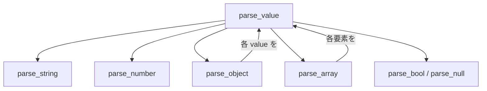
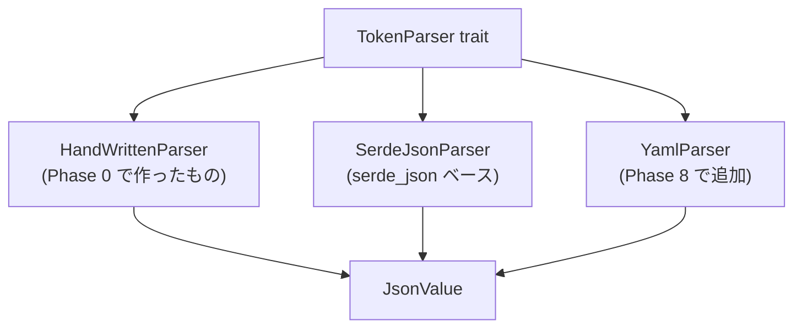

# Phase 0: Hello, Token

最初の一歩として、JSON ファイルを読み込んで中身を表示するプログラムを作る。

## この章で学ぶこと

- `std::fs` によるファイル読み込み
- `Result` によるエラーハンドリング
- コマンドライン引数の取得 (`std::env::args`)
- 自作 JSON パーサーの実装 (文字列の走査、再帰下降パーサー)
- enum を使った JSON 値の表現
- トレイトによるパーサーの抽象化

## ゴール

```sh
cargo run -- tokens/colors.json
```

を実行すると、以下のようにトークンが一覧表示される。

```
  colors.black = "#000000"
  colors.white = "#ffffff"
  colors.brand = "{colors.orange.500}"
  colors.orange.500 = "#ed8936"
  colors.orange.700 = "#c05621"
```

## 準備

### テスト用トークンファイルの作成

プロジェクトルートに `tokens/colors.json` を作成する。
これは Style Dictionary の DTCG 形式に従ったデザイントークンである。

```json
{
  "colors": {
    "$type": "color",
    "black": {
      "$value": "#000000"
    },
    "white": {
      "$value": "#ffffff"
    },
    "brand": {
      "$value": "{colors.orange.500}"
    },
    "orange": {
      "500": {
        "$value": "#ed8936"
      },
      "700": {
        "$value": "#c05621"
      }
    }
  }
}
```

### 依存クレートについて

Phase 0 では外部クレートを使わず、標準ライブラリだけで JSON パーサーを自作する。
`Cargo.toml` の `[dependencies]` は空のままで良い。

後のフェーズで `serde_json` に差し替える。
トレイトで抽象化しておけば、パーサーの実装を自由に入れ替えられる。

## 知識ガイド

### JSON の構文

JSON パーサーを書くには、JSON の構文規則を知る必要がある。
デザイントークンで使う範囲に絞ると、以下の要素だけ対応すればよい。

| 要素 | 例 |
|------|------|
| 文字列 | `"hello"` |
| 数値 | `42`, `3.14` |
| 真偽値 | `true`, `false` |
| null | `null` |
| 配列 | `[1, 2, 3]` |
| オブジェクト | `{"key": "value"}` |

オブジェクトの構文:

```
{ "key1": value1, "key2": value2 }
```

- `{` で始まる
- `"key": value` のペアが `,` で区切られる
- `}` で終わる
- ホワイトスペース (空白、改行、タブ) は無視される

### enum で JSON 値を表現する

Rust の enum はデータを持てる。これを使って JSON の値を表現できる。

```rust
enum JsonValue {
    Null,
    Bool(bool),
    Number(f64),
    String(String),
    Array(Vec<JsonValue>),
    Object(Vec<(String, JsonValue)>),  // キーと値のペアのリスト
}
```

これが自作パーサーの出力となる内部表現である。
`Object` に `HashMap` ではなく `Vec<(String, JsonValue)>` を使うと、キーの順序が保持される。

### 再帰下降パーサーとは

JSON パーサーは「再帰下降パーサー」で実装するのが最も自然である。
各 JSON 要素に対応する関数を作り、互いに呼び合う構造になる。



パーサーは文字列の「現在位置」を進めながら読み取る。

```rust
struct Parser {
    input: Vec<char>,  // 入力文字列
    pos: usize,        // 現在位置
}
```

基本的なパターン:

- 現在の文字を見て (`input[pos]`)、何をパースするか決める
- パースしたら `pos` を進める
- 予期しない文字に出会ったらエラーを返す

### std::fs::read_to_string

ファイルの中身を `String` として読み込む。戻り値は `Result<String, std::io::Error>` である。

### std::env::args

コマンドライン引数を取得する。`cargo run -- tokens/colors.json` と実行した場合:

- `args[0]` = 実行ファイルパス
- `args[1]` = `"tokens/colors.json"` (ユーザーが渡した引数)

### ? 演算子と main の戻り値

`main` の戻り値を `Result` にすると、`?` 演算子でエラーを簡潔に処理できる。

```rust
fn main() -> Result<(), Box<dyn std::error::Error>> {
    let content = fs::read_to_string("file.json")?;  // エラーなら即終了
    Ok(())
}
```

`Box<dyn std::error::Error>` は「あらゆるエラー型を受け取れる箱」である。

### 再帰と可変借用

`Vec` を `&mut` で渡すと、呼び出し先で `push` / `pop` して状態を管理できる。
再帰関数でパスを積み上げていくのに使う。

```rust
fn walk(path: &mut Vec<String>) {
    path.push("child".to_string());
    // ... 再帰呼び出し ...
    path.pop();  // 戻るときに元に戻す
}
```

## 課題

### 課題 0: コマンドライン引数でファイルパスを受け取る

`std::env::args` を使い、引数が足りないときはエラーメッセージを表示して終了するプログラムを書こう。

確認:

```sh
cargo run                        # → "Usage: ssotyle <file>" と表示されること
cargo run -- tokens/colors.json  # → ファイルパスが表示されること
```

ヒント: `eprintln!` は標準エラー出力に書き出す。`std::process::exit(1)` で異常終了できる。

### 課題 1: ファイルを読み込んで表示する

引数で受け取ったパスのファイルを読み込み、中身をそのまま表示しよう。

確認:

```sh
cargo run -- tokens/colors.json  # → JSON の中身がそのまま表示されること
```

ヒント: `std::fs::read_to_string` と `?` 演算子を使う。`main` の戻り値の型を変える必要がある。

### 課題 2: JsonValue enum を定義する

JSON の値を表す `JsonValue` enum を定義しよう。

対応すべき型:

- null
- 真偽値
- 数値 (f64)
- 文字列
- 配列
- オブジェクト

この時点ではまだ使わなくて良い。定義だけで OK。

### 課題 3: 簡易 JSON パーサーを作る

ここが本題。`Parser` 構造体を作り、JSON 文字列を `JsonValue` に変換する。

まず以下のヘルパーメソッドを実装する:

- `skip_whitespace` — 空白・改行・タブを読み飛ばす
- `peek` — 現在位置の文字を返す (位置は進めない)
- `advance` — 現在位置を 1 つ進める

次に、各 JSON 要素のパース関数を実装する。推奨する順序:

- `parse_string` — `"` で始まり `"` で終わる文字列を読む
- `parse_number` — 数字と `.` を読んで `f64` に変換する
- `parse_null` — `null` の 4 文字を読む
- `parse_bool` — `true` または `false` を読む
- `parse_array` — `[` で始まり、`,` 区切りで `parse_value` を呼び、`]` で終わる
- `parse_object` — `{` で始まり、`"key": value` のペアを読み、`}` で終わる
- `parse_value` — 最初の文字を見て上記のどれかを呼び分ける

確認:

```rust
let input = r#"{"name": "test", "value": 42}"#;
// パースして JsonValue::Object が得られること
```

ヒント:

- `parse_value` は `peek()` の結果で分岐する。`"` なら文字列、`{` ならオブジェクト、`[` なら配列、`t`/`f` なら真偽値、`n` なら null、数字なら数値
- エラーは `Result<JsonValue, String>` で返すのが最も簡単。エラーメッセージに現在位置を含めると、デバッグしやすい
- エスケープシーケンス (`\"`, `\\` 等) は最初は無視して良い。デザイントークンでは滅多に出てこない

### 課題 4: トークンを再帰的に探索して一覧表示する

パースした `JsonValue` を再帰的に走査し、`$value` を持つノードをトークンとして表示する関数を作ろう。

以下のシグネチャの関数を実装する:

```rust
fn visit_tokens(value: &JsonValue, path: &mut Vec<String>) {
    // ここを実装する
}
```

考えるポイント:

- `value` がオブジェクトでなければ何もしない
- オブジェクトに `$value` キーがあれば、それはトークン。`path` を `.` で結合して表示する
- `$value` がなければ、各キーについて再帰的に探索する
- `$` で始まるキー (`$type` 等) はメタデータなのでスキップする

確認:

```sh
cargo run -- tokens/colors.json
```

期待する出力:

```
  colors.black = "#000000"
  colors.white = "#ffffff"
  colors.brand = "{colors.orange.500}"
  colors.orange.500 = "#ed8936"
  colors.orange.700 = "#c05621"
```

## チャレンジ課題

Phase 0 の理解を深めるための追加課題。必須ではない。

- `$type` の情報も一緒に表示してみよう。`$type` はグループレベルで定義され、子トークンに継承される。`visit_tokens` に `current_type: Option<&str>` 引数を追加して、型の伝播を実装できるか試してみよう
- 存在しないファイルパスを渡したとき、どんなエラーメッセージが表示されるか確認しよう。JSON として不正な内容のファイルを渡した場合はどうなるか
- `tokens/dimensions.json` を新たに作成し、2 つのファイルを順番に読み込んで両方のトークンを表示するプログラムに改造してみよう (Phase 1 への布石)

## 次のステップへ

Phase 0 で自作した `JsonValue` と `Parser` は、Phase 1 で `Parser` トレイトとして抽象化する。

```rust
trait TokenParser {
    fn extensions(&self) -> &[&str];
    fn parse(&self, content: &[u8]) -> Result<JsonValue, SsotyleError>;
}
```

こうすることで、自作パーサーと serde ベースのパーサーを自由に差し替えられるようになる。


