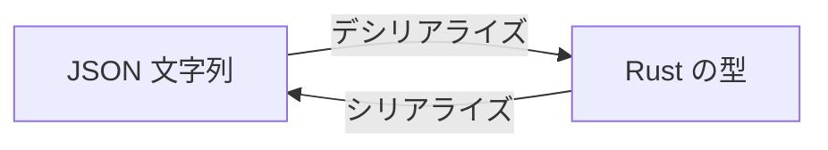

# Phase 0: Hello, Token

最初の一歩として、JSON ファイルを読み込んで中身を表示するプログラムを作る。

## この章で学ぶこと

- `Cargo.toml` への依存クレートの追加
- `serde` と `serde_json` による JSON パース
- `std::fs` によるファイル読み込み
- `Result` によるエラーハンドリング
- コマンドライン引数の取得 (`std::env::args`)

## ゴール

```sh
cargo run -- tokens/colors.json
```

を実行すると、以下のようにトークンが一覧表示される。

```
  colors.black = "#000000"
  colors.white = "#ffffff"
  colors.brand = "{colors.orange.500}"
  colors.orange.500 = "#ed8936"
  colors.orange.700 = "#c05621"
```

## 準備

### テスト用トークンファイルの作成

プロジェクトルートに `tokens/colors.json` を作成する。
これは Style Dictionary の DTCG 形式に従ったデザイントークンである。

```json
{
  "colors": {
    "$type": "color",
    "black": {
      "$value": "#000000"
    },
    "white": {
      "$value": "#ffffff"
    },
    "brand": {
      "$value": "{colors.orange.500}"
    },
    "orange": {
      "500": {
        "$value": "#ed8936"
      },
      "700": {
        "$value": "#c05621"
      }
    }
  }
}
```

### 依存クレートの追加

`Cargo.toml` に `serde` と `serde_json` を追加する。

```toml
[dependencies]
serde = { version = "1", features = ["derive"] }
serde_json = "1"
```

`cargo add` コマンドでも追加できる:

```sh
cargo add serde --features derive
cargo add serde_json
```

## 知識ガイド

各ステップで必要になる知識を紹介する。
コード例は最小限にとどめているので、自分で組み合わせて実装してみよう。

### serde とは

`serde` は Rust のシリアライズ/デシリアライズフレームワークである。
「データ形式」と「Rust の型」の間の変換を担当する。



`serde` 本体はフレームワークだけを提供し、具体的なフォーマットは別クレートが担当する。
この分離が、Phase 8 で YAML / TOML に拡張できる理由でもある。

| クレート | フォーマット |
|----------|------------|
| `serde_json` | JSON |
| `serde_yaml` | YAML |
| `toml` | TOML |

### serde_json::Value

JSON の構造が事前にわからない場合、`serde_json::Value` で動的にパースできる。
デザイントークンはユーザーが自由にネストを定義するため、この動的パースが適している。

`Value` は以下の variant を持つ enum である:

- `Value::Null`
- `Value::Bool(bool)`
- `Value::Number(Number)`
- `Value::String(String)`
- `Value::Array(Vec<Value>)`
- `Value::Object(Map<String, Value>)`

便利メソッド:

- `value.as_object()` — `Option<&Map<String, Value>>` を返す
- `obj.get("key")` — `Option<&Value>` を返す

### std::fs::read_to_string

ファイルの中身を `String` として読み込む。戻り値は `Result<String, std::io::Error>` である。

### std::env::args

コマンドライン引数を取得する。`cargo run -- tokens/colors.json` と実行した場合:

- `args[0]` = 実行ファイルパス
- `args[1]` = `"tokens/colors.json"` (ユーザーが渡した引数)

### ? 演算子と main の戻り値

`main` の戻り値を `Result` にすると、`?` 演算子でエラーを簡潔に処理できる。

```rust
fn main() -> Result<(), Box<dyn std::error::Error>> {
    let content = fs::read_to_string("file.json")?;  // エラーなら即終了
    Ok(())
}
```

`Box<dyn std::error::Error>` は「あらゆるエラー型を受け取れる箱」である。

### 再帰と可変借用

`Vec` を `&mut` で渡すと、呼び出し先で `push` / `pop` して状態を管理できる。
再帰関数でパスを積み上げていくのに使う。

```rust
fn walk(path: &mut Vec<String>) {
    path.push("child".to_string());
    // ... 再帰呼び出し ...
    path.pop();  // 戻るときに元に戻す
}
```

## 課題

### 課題 0: コマンドライン引数でファイルパスを受け取る

`std::env::args` を使い、引数が足りないときはエラーメッセージを表示して終了するプログラムを書こう。

確認:

```sh
cargo run                        # → "Usage: ssotyle <file>" と表示されること
cargo run -- tokens/colors.json  # → ファイルパスが表示されること
```

ヒント: `eprintln!` は標準エラー出力に書き出す。`std::process::exit(1)` で異常終了できる。

### 課題 1: ファイルを読み込んで表示する

引数で受け取ったパスのファイルを読み込み、中身をそのまま表示しよう。

確認:

```sh
cargo run -- tokens/colors.json  # → JSON の中身がそのまま表示されること
```

ヒント: `std::fs::read_to_string` と `?` 演算子を使う。`main` の戻り値の型を変える必要がある。

### 課題 2: JSON としてパースして整形表示する

読み込んだ文字列を `serde_json::Value` にパースし、整形表示しよう。

確認:

```sh
cargo run -- tokens/colors.json  # → インデント付きで表示されること
```

ヒント: `serde_json::from_str` でパースできる。`println!("{:#}", value)` で整形表示できる。

### 課題 3: トークンを再帰的に探索して一覧表示する

ここが本題。ネストされた JSON を再帰的に走査し、`$value` を持つノードをトークンとして表示する関数を作ろう。

以下のシグネチャの関数を実装する:

```rust
fn visit_tokens(value: &Value, path: &mut Vec<String>) {
    // ここを実装する
}
```

考えるポイント:

- `value` がオブジェクトでなければ何もしない
- オブジェクトに `$value` キーがあれば、それはトークン。`path` を `.` で結合して表示する
- `$value` がなければ、各キーについて再帰的に探索する
- `$` で始まるキー (`$type` 等) はメタデータなのでスキップする

確認:

```sh
cargo run -- tokens/colors.json
```

期待する出力:

```
  colors.black = "#000000"
  colors.white = "#ffffff"
  colors.brand = "{colors.orange.500}"
  colors.orange.500 = "#ed8936"
  colors.orange.700 = "#c05621"
```

## チャレンジ課題

Phase 0 の理解を深めるための追加課題。必須ではない。

- `$type` の情報も一緒に表示してみよう。`$type` はグループレベルで定義され、子トークンに継承される。`visit_tokens` に `current_type: Option<&str>` 引数を追加して、型の伝播を実装できるか試してみよう
- 存在しないファイルパスを渡したとき、どんなエラーメッセージが表示されるか確認しよう。JSON として不正な内容のファイルを渡した場合はどうなるか
- `tokens/dimensions.json` を新たに作成し、2 つのファイルを順番に読み込んで両方のトークンを表示するプログラムに改造してみよう (Phase 1 への布石)
