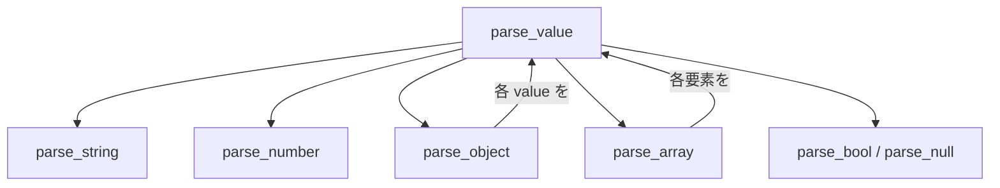
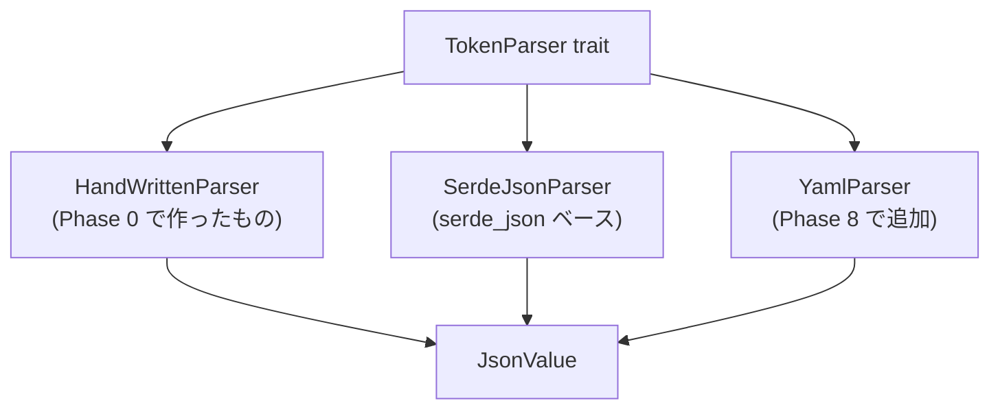

# Phase 0: Hello, Token

最初の一歩として、JSON ファイルを読み込んで中身を表示するプログラムを作る。

## この章で学ぶこと

- `std::fs` によるファイル読み込み
- `Result` によるエラーハンドリング
- コマンドライン引数の取得 (`std::env::args`)
- 自作 JSON パーサーの実装 (文字列の走査、再帰下降パーサー)
- enum を使った JSON 値の表現
- Rust のテストの書き方

## ゴール

`cargo run -- tokens/colors.json` を実行すると、以下のようにトークンが一覧表示される。

```
  colors.black = "#000000"
  colors.white = "#ffffff"
  colors.brand = "{colors.orange.500}"
  colors.orange.500 = "#ed8936"
  colors.orange.700 = "#c05621"
```

## 準備

### テスト用トークンファイルの作成

プロジェクトルートに `tokens/colors.json` を作成する。
これは Style Dictionary の DTCG 形式に従ったデザイントークンである。

```json
{
  "colors": {
    "$type": "color",
    "black": {
      "$value": "#000000"
    },
    "white": {
      "$value": "#ffffff"
    },
    "brand": {
      "$value": "{colors.orange.500}"
    },
    "orange": {
      "500": {
        "$value": "#ed8936"
      },
      "700": {
        "$value": "#c05621"
      }
    }
  }
}
```

### 依存クレートについて

Phase 0 では外部クレートを使わず、標準ライブラリだけで JSON パーサーを自作する。
`Cargo.toml` の `[dependencies]` は空のままで良い。

後のフェーズで `serde_json` に差し替える。
トレイトで抽象化しておけば、パーサーの実装を自由に入れ替えられる。

## 知識ガイド

### JSON の構文

JSON パーサーを書くには、JSON の構文規則を知る必要がある。
デザイントークンで使う範囲に絞ると、以下の要素だけ対応すればよい。

| 要素 | 例 |
|------|------|
| 文字列 | `"hello"` |
| 数値 | `42`, `3.14` |
| 真偽値 | `true`, `false` |
| null | `null` |
| 配列 | `[1, 2, 3]` |
| オブジェクト | `{"key": "value"}` |

オブジェクトは `{` で始まり、`"key": value` のペアが `,` で区切られ、`}` で終わる。
ホワイトスペース (空白、改行、タブ) は無視される。

### enum で JSON 値を表現する

Rust の enum はデータを持てる。これを使って JSON の値を表現できる。

```rust
enum JsonValue {
    Null,
    Bool(bool),
    Number(f64),
    Str(String),
    Array(Vec<JsonValue>),
    Object(Vec<(String, JsonValue)>),
}
```

これが自作パーサーの出力となる内部表現である。
`Object` に `HashMap` ではなく `Vec<(String, JsonValue)>` を使うと、キーの順序が保持される。

### 再帰下降パーサーとは

JSON パーサーは「再帰下降パーサー」で実装するのが最も自然である。
各 JSON 要素に対応する関数を作り、互いに呼び合う構造になる。



パーサーは文字列の「現在位置」を進めながら読み取る。

```rust
struct Parser {
    input: Vec<char>,
    pos: usize,
}
```

- 現在の文字を見て (`input[pos]`)、何をパースするか決める
- パースしたら `pos` を進める
- 予期しない文字に出会ったらエラーを返す

### std::fs::read_to_string

ファイルの中身を `String` として読み込む。戻り値は `Result<String, std::io::Error>` である。

### std::env::args

コマンドライン引数を取得する。`cargo run -- tokens/colors.json` と実行した場合、`args[0]` が実行ファイルパス、`args[1]` が `"tokens/colors.json"` になる。

### ? 演算子と main の戻り値

`main` の戻り値を `Result` にすると、`?` 演算子でエラーを簡潔に処理できる。

```rust
fn main() -> Result<(), Box<dyn std::error::Error>> {
    let content = fs::read_to_string("file.json")?;
    Ok(())
}
```

`Box<dyn std::error::Error>` は「あらゆるエラー型を受け取れる箱」である。

### r#"..."# (raw 文字列リテラル)

`"` を含む文字列を書くには raw 文字列リテラルが便利である。

```rust
r#""hello""#  // → "hello" という文字列 (" が含まれている)
```

### Rust のテスト

テストはファイルの末尾に `#[cfg(test)]` モジュールとして書く。

```rust
#[cfg(test)]
mod tests {
    use super::*;

    #[test]
    fn test_example() {
        assert_eq!(1 + 1, 2);
    }
}
```

- `#[cfg(test)]` — 属性 (attribute)。`cargo test` のときだけコンパイルされる
- `mod tests` — テスト用のモジュール。名前は `tests` が慣例
- `use super::*` — 親モジュール (main.rs) のすべての定義を使えるようにする
- `#[test]` — この関数がテストであることをマーク
- `cargo test` で全テストを実行する

#### assert_eq! と assert!

テスト内で値を検証するマクロ。

```rust
assert_eq!(left, right);  // left と right が等しくなければ失敗
assert!(condition);        // condition が true でなければ失敗
```

#### #[derive(Debug, PartialEq)]

`assert_eq!` で独自の型を比較するには `PartialEq` と `Debug` が必要である。

```rust
#[derive(Debug, PartialEq)]
enum JsonValue {
    // ...
}
```

- `Debug` — `{:?}` で表示できるようにする (テスト失敗時のメッセージに必要)
- `PartialEq` — `==` で比較できるようにする

## 課題

### 課題 0: コマンドライン引数でファイルパスを受け取る

`std::env::args` を使い、引数が足りないときはエラーメッセージを表示して終了するプログラムを書こう。

```sh
cargo run                        # → "Usage: ssotyle <file>" と表示されること
cargo run -- tokens/colors.json  # → ファイルパスが表示されること
```

`eprintln!` は標準エラー出力に書き出す。`std::process::exit(1)` で異常終了できる。

<details>
<summary>課題 0 の解説</summary>

#### 実装例

```rust
fn main() {
    let args: Vec<String> = std::env::args().collect();
    match args.as_slice() {
        [_, filepath] => {
            println!("{}", filepath);
        }
        _ => {
            eprintln!("Usage: ssotyle <file>");
            std::process::exit(1);
        }
    }
}
```

#### `fn main()`

プログラムのエントリポイント (最初に実行される関数)。
`fn` は function (関数) の略。

#### `let args: Vec<String> = ...`

`let` は変数宣言。`: Vec<String>` は型注釈で、「`String` の可変長配列」を意味する。
型注釈は省略可能で、コンパイラが推論してくれる場合が多い。

```rust
let args = std::env::args().collect::<Vec<String>>();  // 型注釈なし、turbofish で指定
let args: Vec<String> = std::env::args().collect();    // 型注釈あり (こちらが読みやすい)
```

#### `std::env::args()`

標準ライブラリの `std` → `env` モジュール → `args` 関数。
コマンドライン引数のイテレータを返す。

`std::env::args()` と書く代わりに、ファイル冒頭で `use` して短く書くこともできる。

```rust
use std::env;
let args: Vec<String> = env::args().collect();
```

#### `.collect()`

イテレータを具体的なコレクション型に変換するメソッド。
`args()` が返すのはイテレータ (遅延評価) なので、`.collect()` で `Vec` に確定させる。

#### `match args.as_slice() { ... }`

`match` は Rust のパターンマッチ構文。値を複数のパターンと照合し、一致したアームを実行する。

`args.as_slice()` は `Vec<String>` を `&[String]` (スライス参照) に変換する。
スライスにすることで、要素数に基づくパターンマッチが使える。

```rust
match args.as_slice() {
    [_, filepath] => { ... }  // 要素がちょうど 2 つ
    _ => { ... }              // それ以外すべて
}
```

`match` は**すべてのパターンを網羅する**必要がある。
`_` (ワイルドカード) は「上のどのパターンにも一致しなかった場合」をキャッチする。

#### `[_, filepath]`

スライスパターン。`[A, B]` は「要素がちょうど 2 つ」のスライスに一致する。

- `_` — 1 つ目の要素 (実行ファイルパス) を無視する
- `filepath` — 2 つ目の要素を `filepath` という名前に束縛 (バインド) する

束縛された `filepath` はそのアーム内で使える。型は `&String` (参照) になる。

```rust
[]           // 空のスライスに一致
[x]          // 要素が 1 つのスライスに一致、x に束縛
[_, _, z]    // 要素が 3 つ、3 つ目だけ使う
[first, ..]  // 1 つ以上、最初の要素だけ使う (.. は残りを無視)
```

#### `=>` (ファットアロー)

`match` アームでパターンと実行するコードを繋ぐ記号。
「このパターンに一致したら、この処理を実行する」という意味。

#### `println!` と `eprintln!`

どちらも文字列を出力するマクロ (`!` はマクロ呼び出しの印)。

- `println!` — 標準出力 (stdout) に書く。プログラムの正常な出力用
- `eprintln!` — 標準エラー出力 (stderr) に書く。エラーメッセージ用

`{}` はプレースホルダーで、引数の値が埋め込まれる。

```rust
println!("{}", filepath);  // filepath の中身が表示される
```

#### `std::process::exit(1)`

プログラムを即座に終了する。引数は終了コード。

- `0` — 正常終了
- `1` 以上 — 異常終了

シェルが終了コードを見て成功/失敗を判断するため、エラー時は `1` を返す慣習がある。

</details>

### 課題 1: ファイルを読み込んで表示する

引数で受け取ったパスのファイルを読み込み、中身をそのまま表示しよう。

```sh
cargo run -- tokens/colors.json  # → JSON の中身がそのまま表示されること
```

`std::fs::read_to_string` と `?` 演算子を使う。`main` の戻り値の型を変える必要がある。

<details>
<summary>課題 1 の解説</summary>

#### 実装例

```rust
fn main() -> Result<(), Box<dyn std::error::Error>> {
    let args: Vec<String> = std::env::args().collect();
    match args.as_slice() {
        [_, filepath] => {
            let content = std::fs::read_to_string(filepath)?;
            println!("{}", content);
        }
        _ => {
            eprintln!("Usage: ssotyle <file>");
            std::process::exit(1);
        }
    }
    Ok(())
}
```

#### `-> Result<(), Box<dyn std::error::Error>>`

関数の戻り値の型。課題 0 の `main` は何も返さなかったが、`?` 演算子を使うために `Result` を返す必要がある。

- `Result<(), Box<dyn std::error::Error>>` — 成功時は `()` (何もない)、失敗時はエラー
- `Box<dyn std::error::Error>` — あらゆる種類のエラーを入れられる箱。`std::io::Error` (ファイル読み込み失敗) なども受け取れる

#### `Box<dyn ...>` とは

分解すると 2 つの概念がある。

- `dyn` — 「動的ディスパッチ」の略。具体的な型を決めず、トレイト (インターフェース) だけを指定する。`dyn std::error::Error` は「`Error` トレイトを実装している何かの型」を意味する
- `Box` — ヒープ (メモリ領域) に値を置く箱。`dyn` で型のサイズが不定なので、`Box` で包んでポインタ経由で扱う

なぜ必要かというと、`?` が返すエラーの具体的な型は場所によって異なる (ファイル読み込みなら `io::Error`、JSON パースなら別の型) ため、「どんなエラーでも OK」という柔軟な型が必要になる。

今は「おまじない」として覚えておけば大丈夫。Phase 5 のトレイトオブジェクトで改めて `dyn` を扱う。

#### `?` 演算子

`Result` を返す式の末尾に `?` を付けると、以下のように動作する。

- `Ok(値)` なら → 値を取り出して処理を続ける
- `Err(エラー)` なら → 関数から即座に `Err(エラー)` を返す

```rust
let content = std::fs::read_to_string(filepath)?;
```

これは以下と同じ意味である。

```rust
let content = match std::fs::read_to_string(filepath) {
    Ok(s) => s,
    Err(e) => return Err(e.into()),
};
```

`?` のおかげで 1 行で書ける。

#### `Ok(())`

関数の最後に書く。「正常に終了した」ことを表す。
`Result` を返す関数なので、成功時も明示的に `Ok` で包む必要がある。

`()` は Rust の「何もない値」(ユニット型)。他の言語の `void` に近い。

</details>

### 課題 2: JsonValue enum を定義する

JSON の値を表す `JsonValue` enum を定義しよう。以下の型に対応する。

- null
- 真偽値
- 数値 (f64)
- 文字列
- 配列
- オブジェクト

この時点ではまだ使わなくて良い。定義だけで OK。

<details>
<summary>課題 2 の解説</summary>

#### 実装例

```rust
enum JsonValue {
    Null,
    Bool(bool),
    Number(f64),
    Str(String),
    Array(Vec<JsonValue>),
    Object(Vec<(String, JsonValue)>),
}
```

#### Rust の enum とは

Rust の enum は「この値は A か B か C のどれかである」を表す型。
他の言語の enum は数値の列挙だけだが、Rust の enum は各 variant がデータを持てる。

```rust
// 他の言語の enum に近い (データなし)
enum Direction {
    Up,
    Down,
    Left,
    Right,
}

// Rust ならではの enum (データあり)
enum JsonValue {
    Null,           // データなし
    Bool(bool),     // bool を 1 つ持つ
    Number(f64),    // f64 を 1 つ持つ
    Str(String),    // String を 1 つ持つ
    Array(Vec<JsonValue>),              // JsonValue の配列を持つ
    Object(Vec<(String, JsonValue)>),   // キーと値のペアの配列を持つ
}
```

ある時点で `JsonValue` は上記の variant のうち**ちょうど 1 つ**の状態にある。
文字列であると同時に数値であることはない。

#### variant の書き方

```rust
// データなし
Null,

// データ 1 つ
Bool(bool),

// 複数のデータをまとめたいときはタプル
Object(Vec<(String, JsonValue)>),
//          ^                ^  タプル: 2 つの値を 1 つにまとめる
```

`Vec<(String, JsonValue)>` は「`(String, JsonValue)` のタプルを要素とする配列」。
`Vec<String, JsonValue>` と書くとコンパイルエラーになる。`Vec` は型引数を 1 つしか取れないため。

#### 再帰的な型

`Array(Vec<JsonValue>)` は `JsonValue` の中に `JsonValue` が入る再帰構造。
JSON 自体がネストする構造 (`[1, [2, 3]]` 等) なので、型もそれを反映する。

`Vec` はヒープにデータを置くため、コンパイラがサイズを決定できる。
もし `Vec` なしで `Array(JsonValue)` と書くと、サイズが無限になりコンパイルエラーになる。

#### enum の使い方 (次の課題で使う)

enum の値を作るには `enum名::variant名` と書く。

```rust
let v1 = JsonValue::Null;
let v2 = JsonValue::Number(42.0);
let v3 = JsonValue::Str("hello".to_string());
```

enum の値を取り出すには `match` を使う。

```rust
match value {
    JsonValue::Null => println!("null"),
    JsonValue::Bool(b) => println!("{}", b),
    JsonValue::Number(n) => println!("{}", n),
    JsonValue::Str(s) => println!("{}", s),
    JsonValue::Array(arr) => println!("配列: {} 要素", arr.len()),
    JsonValue::Object(obj) => println!("オブジェクト: {} キー", obj.len()),
}
```

</details>

### 課題 3: 簡易 JSON パーサーを作る

`Parser` 構造体を作り、JSON 文字列を `JsonValue` に変換する。

#### 課題 3-0: Parser 構造体とヘルパーメソッド

`Parser` 構造体を定義し、3 つのヘルパーメソッドを実装する。

- `peek(&self) -> Option<char>` — 現在位置の文字を返す (位置は進めない)
- `advance(&mut self)` — 位置を 1 つ進める
- `skip_whitespace(&mut self)` — 空白・改行・タブを読み飛ばす

#### 課題 3-1: parse_string を実装する

`"hello"` のような文字列をパースする関数を実装しよう。

- `"` で始まり `"` で終わる文字列を読む
- 最初の `"` を `advance()` で飛ばす
- `"` が来るまで文字を `Vec<char>` に集める
- エスケープシーケンス (`\"`, `\\` 等) は無視して良い

#### 課題 3-2: parse_string のテストを書く

実装したら、テストを書いて動作を確認しよう。
テストの書き方は知識ガイドの「Rust のテスト」を参照。

書くべきテストケースは以下の通り。

- 通常の文字列: `"hello"`
- 空文字列: `""`
- 空白を含む文字列: `"hello world"`
- 閉じ `"` がない場合のエラー: `"hello`

#### 課題 3-3: 残りのパース関数を test first で実装する

ここからは順番を変えて、**テストを先に書いてから実装する**流れで進めてみよう。

テストを先に書くことで、実装前に「何を作るか」が明確になり、テストが通った瞬間に「完成」がわかる。

##### parse_number

- 数字と `.` と `-` を集めて `f64` に変換する
- `char` には `.is_ascii_digit()` メソッドがある
- 集めた `String` を `.parse::<f64>()` で変換する

##### parse_null

- `advance()` を 4 回呼ぶだけ

##### parse_bool

- `peek()` で最初の文字を見て `t` なら 4 文字、`f` なら 5 文字進める

##### parse_array

- `[` を飛ばして `loop` で回す
- `]` なら終了、`,` なら飛ばす、それ以外なら `parse_value()` で要素を読む

##### parse_object

- `parse_array` とほぼ同じ構造
- `Some(_)` の中で `parse_string` でキーを読み、`:` を飛ばし、`parse_value` で値を読む

##### parse_value

- `skip_whitespace` してから `peek()` の結果で `parse_string`, `parse_object` 等に振り分ける
- 各パース関数の結果を `JsonValue` の variant に包んで返す

### 課題 4: トークンを再帰的に探索して一覧表示する

パースした `JsonValue` を再帰的に走査し、`$value` を持つノードをトークンとして表示する関数を作ろう。

`Vec` を `&mut` で渡すと、呼び出し先で `push` / `pop` して状態を管理できる。再帰関数でパスを積み上げていくのに使う。

```rust
fn visit_tokens(value: &JsonValue, path: &mut Vec<String>) {
    // ここを実装する
}
```

- `value` がオブジェクトでなければ何もしない
- オブジェクトに `$value` キーがあれば、それはトークン。`path` を `.` で結合して表示する
- `$value` がなければ、各キーについて再帰的に探索する
- `$` で始まるキー (`$type` 等) はメタデータなのでスキップする

## チャレンジ課題

Phase 0 の理解を深めるための追加課題。必須ではない。

- `$type` の情報も一緒に表示してみよう。`$type` はグループレベルで定義され、子トークンに継承される。`visit_tokens` に `current_type: Option<&str>` 引数を追加して、型の伝播を実装できるか試してみよう
- 存在しないファイルパスを渡したとき、どんなエラーメッセージが表示されるか確認しよう。JSON として不正な内容のファイルを渡した場合はどうなるか
- `tokens/dimensions.json` を新たに作成し、2 つのファイルを順番に読み込んで両方のトークンを表示するプログラムに改造してみよう (Phase 1 への布石)

## 次のステップへ

Phase 0 で自作した `JsonValue` と `Parser` は、Phase 1 で `Parser` トレイトとして抽象化する。

```rust
trait TokenParser {
    fn extensions(&self) -> &[&str];
    fn parse(&self, content: &[u8]) -> Result<JsonValue, SsotyleError>;
}
```

こうすることで、自作パーサーと serde ベースのパーサーを自由に差し替えられるようになる。


