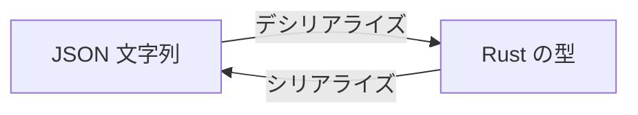

# Phase 0: Hello, Token

最初の一歩として、JSON ファイルを読み込んで中身を表示するプログラムを作る。

## この章で学ぶこと

- `Cargo.toml` への依存クレートの追加
- `serde` と `serde_json` による JSON パース
- `std::fs` によるファイル読み込み
- `Result` によるエラーハンドリング
- コマンドライン引数の取得 (`std::env::args`)

## ゴール

```sh
cargo run -- tokens/colors.json
```

を実行すると、トークンファイルの中身が整形表示される。

## 準備

### テスト用トークンファイルの作成

プロジェクトルートに `tokens/colors.json` を作成する。
これは Style Dictionary の DTCG 形式に従ったデザイントークンである。

```json
{
  "colors": {
    "$type": "color",
    "black": {
      "$value": "#000000"
    },
    "white": {
      "$value": "#ffffff"
    },
    "brand": {
      "$value": "{colors.orange.500}"
    },
    "orange": {
      "500": {
        "$value": "#ed8936"
      },
      "700": {
        "$value": "#c05621"
      }
    }
  }
}
```

### 依存クレートの追加

`Cargo.toml` に `serde` と `serde_json` を追加する。

```toml
[dependencies]
serde = { version = "1", features = ["derive"] }
serde_json = "1"
```

`cargo add` コマンドでも追加できる:

```sh
cargo add serde --features derive
cargo add serde_json
```

## 解説

### serde とは

`serde` は Rust のシリアライズ/デシリアライズフレームワークである。
「データ形式」と「Rust の型」の間の変換を担当する。



`serde` 本体はフレームワークだけを提供し、具体的なフォーマットは別クレートが担当する。
この分離が、Phase 8 で YAML / TOML に拡張できる理由でもある。

| クレート | フォーマット |
|----------|------------|
| `serde_json` | JSON |
| `serde_yaml` | YAML |
| `toml` | TOML |

### serde_json::Value

JSON の構造が事前にわからない場合、`serde_json::Value` で動的にパースできる。
デザイントークンはユーザーが自由にネストを定義するため、この動的パースが適している。

```rust
use serde_json::Value;

// Value は JSON の各型に対応する enum
// Value::Null
// Value::Bool(bool)
// Value::Number(Number)
// Value::String(String)
// Value::Array(Vec<Value>)
// Value::Object(Map<String, Value>)
```

### std::fs::read_to_string

ファイルの中身を `String` として読み込む関数。
戻り値は `Result<String, std::io::Error>` である。

```rust
use std::fs;

// 成功すれば String、失敗すれば io::Error が返る
let content: Result<String, std::io::Error> = fs::read_to_string("tokens/colors.json");
```

### std::env::args

コマンドライン引数を取得する。

```sh
cargo run -- tokens/colors.json
```

と実行した場合:

```rust
use std::env;

let args: Vec<String> = env::args().collect();
// args[0] = "target/debug/ssotyle"  (実行ファイルパス)
// args[1] = "tokens/colors.json"    (ユーザーが渡した引数)
```

### ? 演算子と main の戻り値

`main` 関数の戻り値を `Result` にすると、`?` 演算子でエラーを簡潔に処理できる。

```rust
fn main() -> Result<(), Box<dyn std::error::Error>> {
    let content = fs::read_to_string("file.json")?;  // エラーなら即終了
    Ok(())
}
```

`Box<dyn std::error::Error>` は「あらゆるエラー型を受け取れる箱」である。
Phase 0 ではこれで十分。後の Phase で独自エラー型 (`thiserror`) に置き換える。

## 実装手順

### Step 0: コマンドライン引数でファイルパスを受け取る

```rust
use std::env;

fn main() {
    let args: Vec<String> = env::args().collect();

    if args.len() < 2 {
        eprintln!("Usage: ssotyle <file>");
        std::process::exit(1);
    }

    let file_path = &args[1];
    println!("File: {}", file_path);
}
```

`eprintln!` は標準エラー出力に書き出す。ユーザー向けのエラーメッセージに使う。

`cargo run` で実行するときは `--` の後に引数を渡す:

```sh
cargo run -- tokens/colors.json
```

`--` がないと cargo 自身のオプションとして解釈されてしまう。

### Step 1: ファイルを読み込む

```rust
use std::env;
use std::fs;

fn main() -> Result<(), Box<dyn std::error::Error>> {
    let args: Vec<String> = env::args().collect();

    if args.len() < 2 {
        eprintln!("Usage: ssotyle <file>");
        std::process::exit(1);
    }

    let file_path = &args[1];
    let content = fs::read_to_string(file_path)?;
    println!("{}", content);

    Ok(())
}
```

この時点で `cargo run -- tokens/colors.json` を実行すると、ファイルの中身がそのまま表示される。

### Step 2: JSON としてパースする

```rust
use serde_json::Value;
use std::env;
use std::fs;

fn main() -> Result<(), Box<dyn std::error::Error>> {
    let args: Vec<String> = env::args().collect();

    if args.len() < 2 {
        eprintln!("Usage: ssotyle <file>");
        std::process::exit(1);
    }

    let file_path = &args[1];
    let content = fs::read_to_string(file_path)?;
    let value: Value = serde_json::from_str(&content)?;

    println!("{:#}", value);

    Ok(())
}
```

- `serde_json::from_str` — 文字列を JSON としてパースする。失敗すると `serde_json::Error` を返す
- `{:#}` — `Value` の `Display` 実装により整形 (pretty-print) 表示される

### Step 3: トークンを探索して一覧表示する

ネストされた JSON を再帰的に走査し、`$value` を持つノードをトークンとして表示する。

```rust
use serde_json::Value;
use std::env;
use std::fs;

fn main() -> Result<(), Box<dyn std::error::Error>> {
    let args: Vec<String> = env::args().collect();

    if args.len() < 2 {
        eprintln!("Usage: ssotyle <file>");
        std::process::exit(1);
    }

    let file_path = &args[1];
    let content = fs::read_to_string(file_path)?;
    let value: Value = serde_json::from_str(&content)?;

    let mut path: Vec<String> = Vec::new();
    visit_tokens(&value, &mut path);

    Ok(())
}

fn visit_tokens(value: &Value, path: &mut Vec<String>) {
    // Value がオブジェクトの場合のみ処理する
    let obj = match value.as_object() {
        Some(obj) => obj,
        None => return,
    };

    // $value キーがあればトークンとして表示
    if let Some(token_value) = obj.get("$value") {
        let path_str = path.join(".");
        println!("  {path_str} = {token_value}");
        return;
    }

    // $value がなければ子ノードを再帰的に探索
    for (key, child) in obj {
        // $ で始まるキーはメタデータなのでスキップ
        if key.starts_with('$') {
            continue;
        }
        path.push(key.clone());
        visit_tokens(child, path);
        path.pop();
    }
}
```

実行結果:

```
  colors.black = "#000000"
  colors.white = "#ffffff"
  colors.brand = "{colors.orange.500}"
  colors.orange.500 = "#ed8936"
  colors.orange.700 = "#c05621"
```

ポイント:

- `&Value` — 所有権を移動せず、借用 (参照) で渡している
- `&mut Vec<String>` — パスを可変借用で渡し、`push` / `pop` で状態を管理する。これにより再帰の各段階で現在のパスを追跡できる
- `match` と `if let` — Rust のパターンマッチ。`Option` や `Value` から中身を安全に取り出す
- `key.starts_with('$')` — `$type` や `$description` などのメタデータをスキップ

## 演習

Phase 0 の理解を深めるための課題。

- `$type` の情報も一緒に表示してみよう。`$type` はグループレベルで定義され、子トークンに継承される。`visit_tokens` 関数に `current_type: Option<&str>` 引数を追加して、型の伝播を実装できるか試してみよう
- 存在しないファイルパスを渡したとき、どんなエラーメッセージが表示されるか確認しよう。また、JSON として不正な内容のファイルを渡した場合はどうなるか試してみよう
- `tokens/dimensions.json` を新たに作成し、2 つのファイルを順番に読み込んで両方のトークンを表示するプログラムに改造してみよう (Phase 1 への布石)
